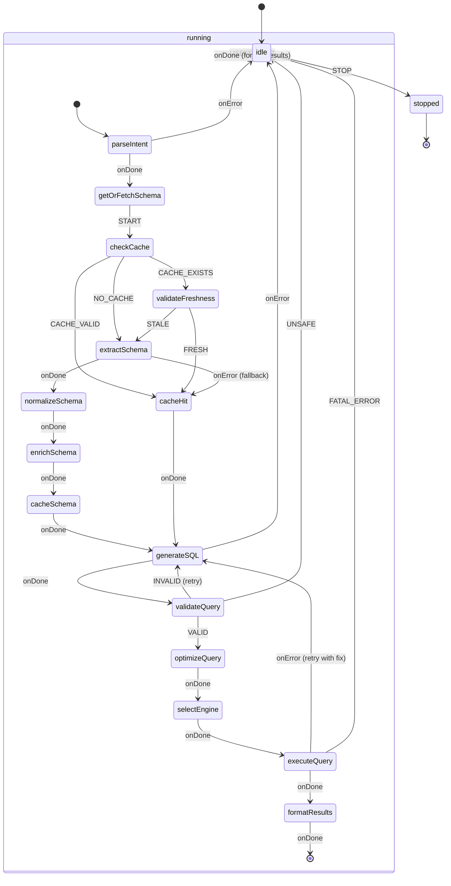

# Text-to-SQL Agent State Machine Diagram

## XState-Compatible Mermaid State Diagram

## State Descriptions

### Top-Level States

- **idle**: Waiting for user input
- **running**: Processing text-to-SQL request (composite state)
- **stopped**: Final state (agent terminated)

### Running Sub-States

1. **parseIntent**: Extracts datasource ID and natural language query from user input
2. **getOrFetchSchema**: Orchestrates schema retrieval with caching
3. **checkCache**: Checks L1 (memory) and L2 (IndexedDB) caches
4. **validateFreshness**: Performs lightweight metadata check (table count, timestamps)
5. **extractSchema**: Calls provider-specific schema extraction via extensions-sdk
6. **normalizeSchema**: Converts provider schema to `SimpleSchema` format
7. **enrichSchema**: Adds sample data and metadata (optional, async)
8. **cacheSchema**: Stores schema in L1 and L2 caches
9. **generateSQL**: LLM generates SQL query with schema context
10. **validateQuery**: Syntax validation and safety checks
11. **optimizeQuery**: Applies query optimizations (LIMIT, index hints, etc.)
12. **selectEngine**: Chooses optimal query execution engine
13. **executeQuery**: Executes query via selected engine
14. **formatResults**: Formats query results for user display

## Guard Conditions

- `CACHE_VALID`: Schema exists in cache and is within TTL
- `CACHE_EXISTS`: Schema exists but may be stale
- `NO_CACHE`: No cached schema found
- `STALE`: Schema freshness check failed (metadata changed)
- `FRESH`: Schema is up-to-date
- `VALID`: Query passes syntax and safety validation
- `INVALID`: Query has syntax errors (retryable)
- `UNSAFE`: Query contains destructive operations (non-retryable)

## Actions

- `assign`: Updates context with schema, query, results
- `cacheSchema`: Stores schema in cache layers
- `logError`: Logs errors for debugging
- `retryWithFix`: Retries SQL generation with error context

## Events

- `USER_INPUT`: User sends natural language query
- `STOP`: User cancels operation
- `onDone`: Actor completes successfully
- `onError`: Actor fails (with error type)

